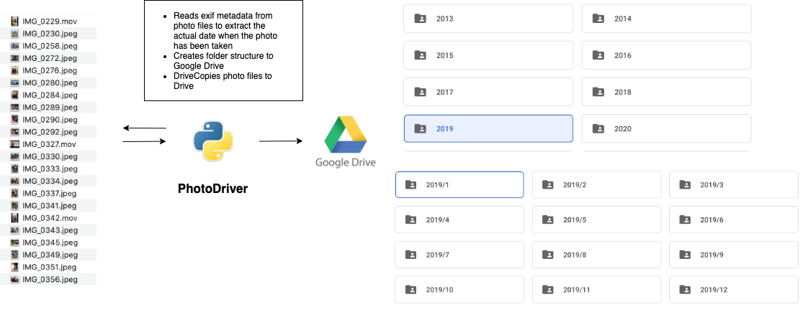

# PhotoDriver

It's easy to collect massive collections of photos with modern digital devices, especially if you
have small children. I ended up in a situation where I had hundreds of photos in my phone and camera
collected in about two-year period with no backups. I've used Google Drive as a cloud storage for my photos where I've
created
chronological folder structure for each month (2020/1, 2020/2...). So to avoid manual work I created this
Python script to automate file copying from local hard drive to Google Drive. I chose Python as a language partly
for learning purposes so if you find something stupid here feel free to raise an issue or make a pull request.

## Content

* [How it works](#how-it-works)
* [Running this project](#running-this-project)
* [Configuration](#configuration)
* [Tested operating systems](#tested-operating-systems)

## How it works

Script reads photo files from local hard drive and checks creation date from exif metadata. Then it copies the file
to correct Google Drive folder and creates file name from creation date and location, e.g. "2022.07.27_20:00:
50_København". Creation date and location are based on photo's exif data. Project
uses [PyDrive2](https://pypi.org/project/PyDrive2/)
library to communicate with Google Drive API. External application [https://exiftool.org/](exiftool) is also needed
to be installed, it's used for getting video location. I couldn't find a good library for that.

## Running this project

* Install python3 and pip3
* Create virtual environment for project
  `python3 -m venv <project folder>`
* Activate virtual environment
  `source <project folder/bin/actvate>`
* Install dependencies
  `pip install -r requirements.txt`
* Run `photo_driver.py`
* Exit virtual environment
  `deactivate`

## Configuration

Setup Google Drive and application authorization using instructions
in [PyDrive documentation](https://gsuitedevs.github.io/PyDrive/docs/build/html/quickstart.html#authentication).
Then fill in these setting:

* Put your `client_id` and `client_secret` to [settings.yml](settings.yaml) file
* Navigate to your Google Drive root folder for your photos and put its id to`DRIVE_ROOT_FOLDER` variable in
  [photo_driver.py](photo_driver.py) file
* Put your local photo folder to `PHOTO_FOLDER` variable. Application creates `/uploaded` folder
  you photo folder and moves copied files there.

When you start this program first time you are asked to go through OAuth process using browser.
After authorization has been done manually `credentials.json` file will be created to your project folder and
used for authorization so that you don't have to go through manual OAuth process every time you run the
application.

## Tested operating systems

I've tested the application with Mac and Ubuntu, I've no idea if it works in Windows...
